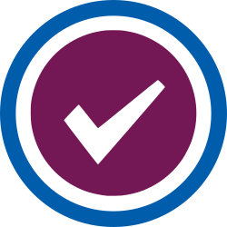

# RSE-ops CI



This is a set of example GitHub Actions that will get you started to build
testing containers for a build strategy of choice. 
The subfolders here match to different testing frameworks, meaning the defaults
are optimal for that kind of test.

 - [cmake](cmake): An example of a build matrix for a cmake project.

It is recommended to view the documentation in the [web interface](https://rse-ops.github.io/ci/).
However, if you read it here in GitHub, you can safely remove occurrences of `` and ``
that are only there to aid the site rendering.

## Adding an Example

An example can exist in its own subfolder, akin to the list shown above.
For each example you should add:

1. A Dockerfile and (if appropriate) an uptodate.yaml that works with it
2. A GitHub workflow in [.github/workflows](.github/workflows) that demonstrates running the build and test, named like `test-<folder>.yaml` (e.g., `test-cmake.yaml`).
3. A README.md in the same folder that also has the following header to render into the site navigation:


```
---
title: Cmake Continuous Integration
layout: page-two-col
parent: Continuous Integration
active: Continuous Integration
---

# Cmake CI

{:.no_toc}

This is an example for how to set up a GitHub Action to test your Cmake project.

* TOC
{:toc}
```

For any GitHub variables in the format `${{ varname }}` You should surround with `` and ``
( e.g., `${{ varname }}` so it correctly renders with Jekyll. 

To develop, meaning installing and running Jekyll locally, you can follow
the instructions [here](https://github.com/rse-ops/rse-ops.github.io#development).

License
-------

Copyright (c) 2021-2022, Lawrence Livermore National Security, LLC. 
Produced at the Lawrence Livermore National Laboratory.

RADIUSS is licensed under the MIT license [LICENSE](./LICENSE).

Copyrights and patents in the RADIUSS Docker project are retained by
contributors. No copyright assignment is required to contribute to RADIUSS
Docker.

This work was produced under the auspices of the U.S. Department of
Energy by Lawrence Livermore National Laboratory under Contract
DE-AC52-07NA27344.
